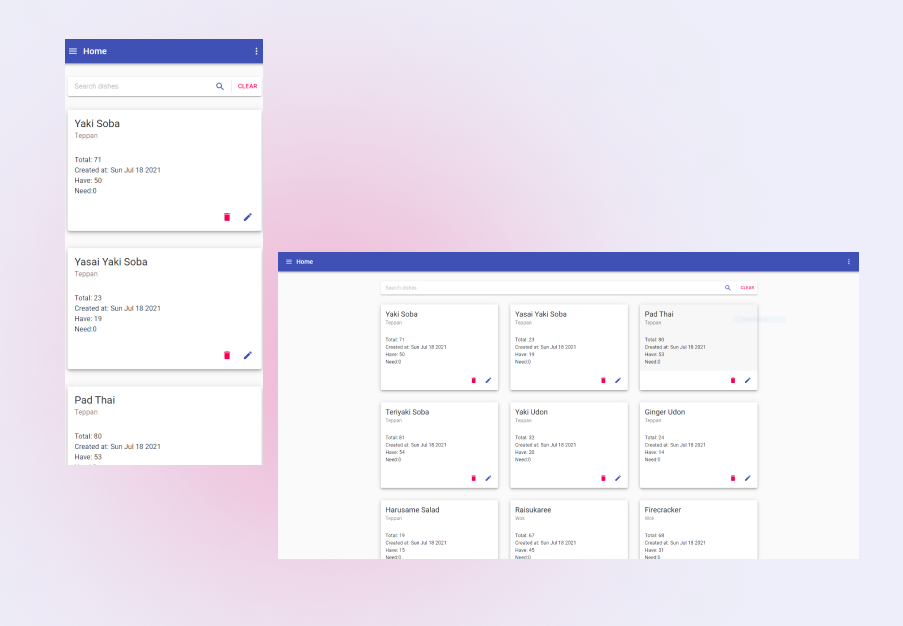

# Prep List
> Prep list app used to keep an eye on prep levels in kitchen.
> Live demo [_here_](https://prep-list-demo.herokuapp.com/).

## Table of Contents
* [General Info](#general-information)
* [Technologies Used](#technologies-used)
* [Features](#features)
* [Screenshots](#screenshots)
* [Setup](#setup)
* [Project Status](#project-status)
* [Room for Improvement](#room-for-improvement)

## General Information
- This app only supports 3 sections: Wok/Fry/Teppan.
- Calculate daily amount of dishes sold and suggest prep levels.
- Purpose of this project was to reduce weekly wastage in commercial kitchen.
- I have built this project as a part of my learning.

## Technologies Used
  ### Client:
  - material-ui - version 4.11.4
  - axios - version 0.21.1
  - chart.js - version 3.4.0
  - lodash - version 4.17.21
  - react - version 17.0.2
  - react-chartjs-2 - version 3.0.3
  - react-redux - version 7.2.4
  - react-router-dom - version 5.2.0
  - react-swipeable-views - version 0.14.0
  - redux - version 4.1.0
  - redux-thunk - version 2.3.0
 
 ### Server:
  - concurrently - version 6.2.0"
  - date-fns - version 2.22.1"
  - dotenv - version 10.0.0"
  - express - version 4.17.1"
  - mongoose - version 5.12.13"
  - nodemon - version 2.0.7"

## Features
- Create your custom list of dishes and update it easily.
- Calculate recommended prep level based on your usage.
- Show product usage on charts.

## Screenshots

## Setup
To run this app you will need to connect yor own MongoDB URI, if deployed on heroku simply add it to Env varaiables.
Run `npm install` and push to heroku.

## Project Status
Project is: _Complete_ 

## Room for Improvement
- "Snackbars" could be added to improve user experience.
- Handle potential errors.

